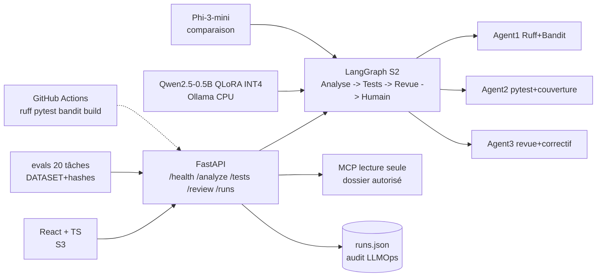
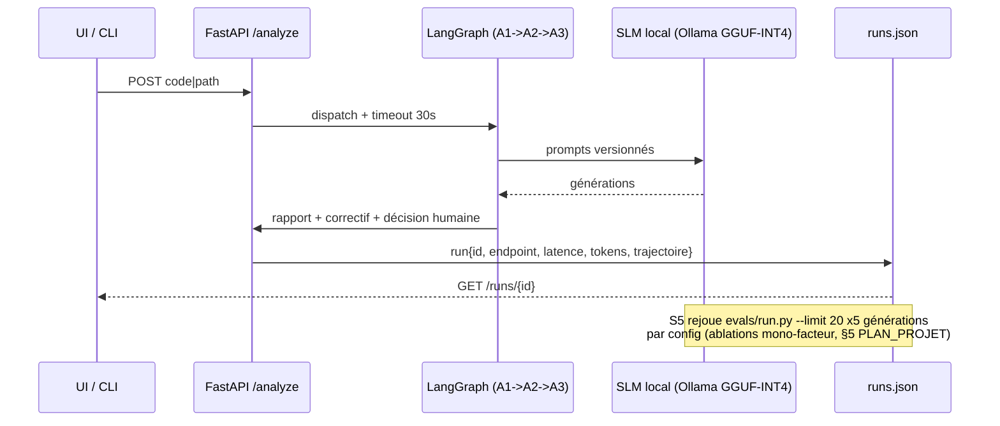

# Architecture — slm-se-assistant (MVP solo, 0 €)

## Vue d'ensemble

## Composants ↔ traçabilité CDC (§3bis PLAN_PROJET)

| Bloc | Code | Exigence PDF couverte |
|---|---|---|
| `backend/main.py` + `schemas.py` | FastAPI `/health /analyze /tests /review /runs/{id}` | Documentation + DevOps (endpoints) |
| Agent1 Analyse | Ruff + Bandit + complexité | Code Analysis agent |
| Agent2 Tests | pytest + couverture + régression | Test Generation + Debugging agents |
| Agent3 Revue | Revue + proposition de correctif | Code Review agent |
| Serveur MCP lecture seule | Outils read-only, dossier autorisé, `../` bloqué | MCP Integration |
| `runs/runs.json` + `evals/results.json` | modèle, prompt, tokens, latence, trajectoire | LLMOps minimal |
| Allow-list, timeout 30s, sandbox tmp, secret-filter, audit sans secrets, 5 scénarios | Sécurité S3 | Security |
| `.github/workflows/`, `README.md`, Docker-Compose offline | CI + rapport + démo 5 min | Documentation + DevOps |

Sont **hors périmètre** : 6 agents, multi-fine-tunes, full-training, K8s, BDD complexe, écriture GitHub via MCP, INT8 si INT4 suffit.

## Séquence — exécution → audit → ablations S5

## Déploiement (S6)

- Priorité : **Docker-Compose local 100 % offline** (frontend + backend + Ollama) pour la démo 5 min.
- GitHub Pages : optionnel uniquement (risque CORS).
- Entraînement QLoRA (Unsloth, fallback transformers+PEFT) : Colab/Kaggle T4 gratuit — seul l'adaptateur + métadonnées sont rapatriés.
- Inférence : GGUF-INT4 CPU via Ollama/llama.cpp (Qwen 0.5B d'abord, 1.5B max si trop faible).

## Fichiers de référence

- Périmètre et planning : `../PLAN_PROJET.txt`
- Backend S1 : `../backend/main.py`, `../backend/schemas.py`, `../backend/tests/test_api.py`
- Benchmark : `../evals/DATASET.md`, `../evals/hashes.txt`, `../evals/run.py`
- Rapport final : `../README.md` (à compléter S6)
