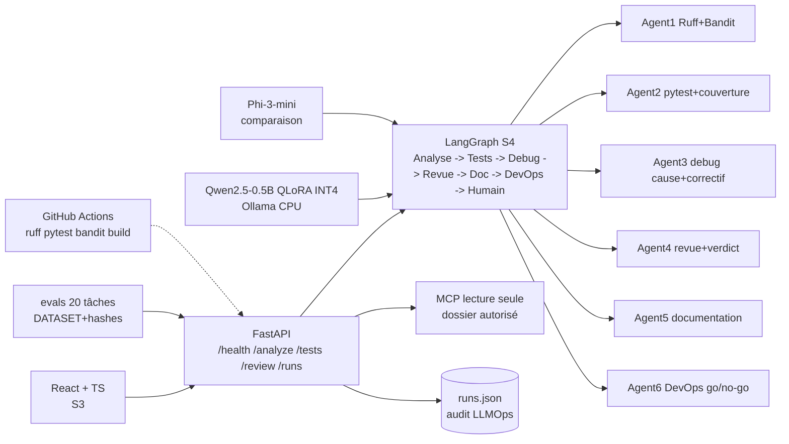
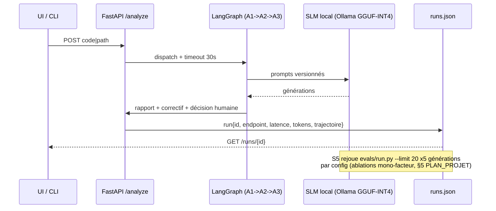

# Architecture — slm-se-assistant (MVP solo, 0 €)

## Vue d'ensemble

## Composants ↔ traçabilité CDC (§3bis PLAN_PROJET)

| Bloc | Code | Exigence PDF couverte |
|---|---|---|
| `backend/main.py` + `schemas.py` | FastAPI `/health /analyze /tests /review /runs/{id}` | Documentation + DevOps (endpoints) |
| Agent1 Analyse | Ruff + Bandit + complexité | Code Analysis agent |
| Agent2 Tests | pytest + couverture + régression | Test Generation + Debugging agents |
| Agent3 Revue | Revue + proposition de correctif | Code Review agent |
| Serveur MCP lecture seule | Outils read-only, dossier autorisé, `../` bloqué | MCP Integration |
| `runs/runs.json` + `evals/results.json` | modèle, prompt, tokens, latence, trajectoire | LLMOps minimal |
| Allow-list, timeout 30s, sandbox tmp, secret-filter, audit sans secrets, 5 scénarios | Sécurité S3 | Security |
| `.github/workflows/`, `README.md`, Docker-Compose offline | CI + rapport + démo 5 min | Documentation + DevOps |

Sont **hors périmètre** : 6 agents, multi-fine-tunes, full-training, K8s, BDD complexe, écriture GitHub via MCP, INT8 si INT4 suffit.

## Séquence — exécution → audit → ablations S5

## Déploiement (S6)

- Priorité : **Docker-Compose local 100 % offline** (frontend + backend + Ollama) pour la démo 5 min.
- GitHub Pages : optionnel uniquement (risque CORS).
- Entraînement QLoRA (Unsloth, fallback transformers+PEFT) : Colab/Kaggle T4 gratuit — seul l'adaptateur + métadonnées sont rapatriés.
- Inférence : GGUF-INT4 CPU via Ollama/llama.cpp (Qwen 0.5B d'abord, 1.5B max si trop faible).

## État S2 (réel, déterministe)

- Graphe : `backend/agents/graph.py` (`build_graph`, `run_pipeline`) — `analyse→tests→debug→revue→documentation→devops→humain`, `model=template-s2`, `prompt=v1`.
- Outils allow-list : `backend/agents/tools.py` (`read_file`, `search_symbols`, `run_ruff`, `run_bandit`, `run_pytest`), `shell=False`, `timeout 30s`, tmp sandbox, `redact()` secrets.
- Endpoints : `/tests` (Agent2) + `/review` (complet) branchés, `/analyze` inchangé, audit `trajectoire` dans `runs/runs.json`.
- Tests : `backend/tests/test_agents.py` (allow-list, algo OK, B102 bloquant) + `test_api.py` (S2 200, 422 traversée, audit sans secret).
- S4 : brancher LLM via adaptateur sans changer le graphe (prompts `backend/agents/prompts/v1/`).

## État S3 (réel — gel features après S3)

- UI : `frontend/` Vite React TS (`App.tsx`, `api.ts` proxy `/api`→8000, `types.ts` miroir schemas),
  CORS backend `localhost:5173` seul, rendu `<pre>` + bandeau non fiable.
- MCP : `mcp_server/server.py` stdio stdlib (`list_files`, `read_file`, `search_symbols`), `../` refusé, sans SDK.
- Sécu : `docs/SECURITY.md`, 5 scénarios `backend/tests/test_security.py` verts, `redact()` étendu (`ghp_`, `Bearer`).
- Docker préparé : `backend/Dockerfile`, `frontend/Dockerfile` (compose S6).
- CI : job `frontend` (`npm ci`, `tsc`, `build`) + backend `ruff/bandit -ll/pytest`.

## État S4-strict (réel — SLM obligatoire, aucun fallback, décision CDC §4)

- Appel : `tools.run_ollama()` via httpx vers `SLM_HOST` (`localhost:11434`), timeout 120s dédié,
  `temperature: 0`, `redact()` avant/après. `slm_model()` vide → `503`, panne Ollama → `503` + run `error`.
- Périmètre : `node_revue` exige `llm_explanation` non vide (`slm_tokens_in/out`, `slm_tokens_per_sec`,
  `slm_ttft_ms` loggés dans `runs.json`). Modèles : `qwen2.5-coder:3b` principal, `0.5b` ablation de base.
- Mesuré Ryzen 3 : `0.5B ~9.4s/gén, ~22 tok/s, TTFT ~2.5s` ; `3B ~25-60s/gén` estimé. `FP16` = T4-only justifié.
- Tests : `backend/tests/test_s4_light.py` (503 sans SLM, 503 panne mock, succès mock) + `conftest.py`
  (mock explicite `mock-ci` pour CI verte ; bench S5 100% réel, sans mock).

## Fichiers de référence

- Périmètre et planning : `../PLAN_PROJET.txt`
- Backend S3 : `../backend/main.py`, `../backend/schemas.py`, `../backend/tests/`, `../backend/agents/`, `../mcp_server/`
- Frontend S3 : `../frontend/src/App.tsx`, `../frontend/src/api.ts`
- Benchmark : `../evals/DATASET.md`, `../evals/hashes.txt`, `../evals/run.py` (20/20 conservé)
- Rapport final : `../README.md` (à compléter S6)
